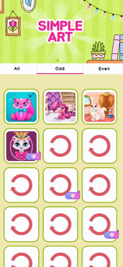
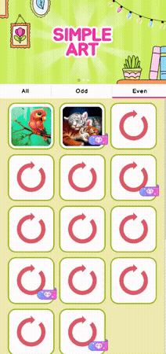
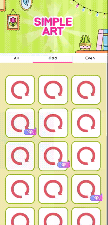
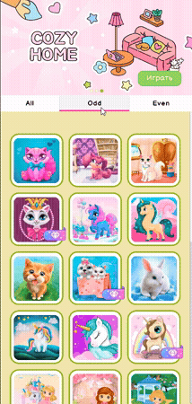

# Реализация адаптивного UI

Данный проект является тестовым заданием.

## Задание

Реализовать адаптивный UI с базовым функционалом:

- По готовому макету из Figma сделать UI.
- Юниты не используют NavMesh, а обходят препятствия собственной логикой.
- Должны присутсвовать припятствия.
- Юнит выбирается кликом.
- При клике по земле - юнит идёт к выбранной точке.
- Юнит должно обходить препятствия и других юнитов.
- Движение — только плавное.
- Адаптировать галерею под планшеты.

---

[Скачать билд с Google Drive](https://drive.google.com/drive/folders/1bvtNpKe4oDjlD7LG9PaLaPtXtKERx-Bx?usp=sharing)

---

## Что есть в приложении:

### Карусель, которая меняет изображение каждые 5 секунд: 

  

### Небольшые анимации скролла и таб бара:

  

### Загрузка данные по мере продивжения скролла:

  

### Анимации кнопок и попапы:

  

---
## На уровне движка есть проверка на тип устройства пользователя, а также debug мод для тстирования. 
